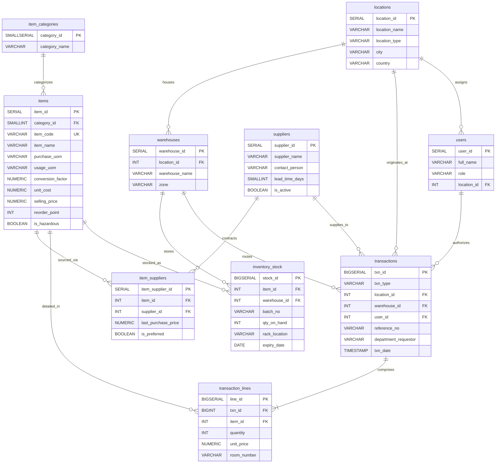
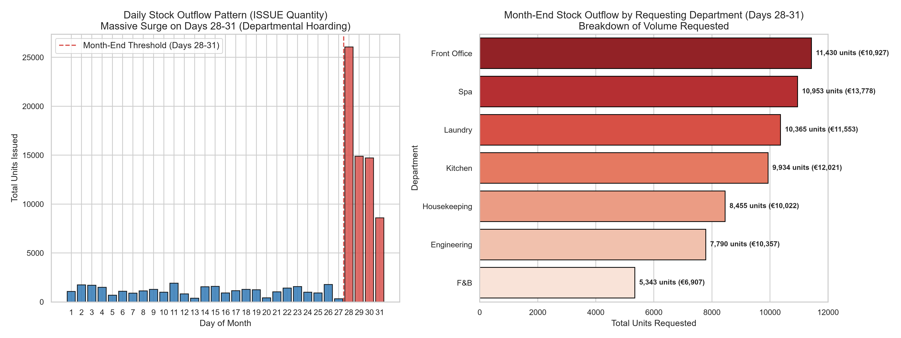
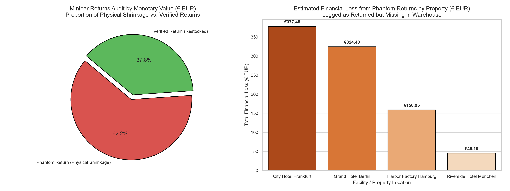

# 🏨 Multi-Facility Operational Inventory Tracking & Supply Chain Audit System
> **Enterprise Relational Database Architecture, Data Pipeline, and Anomaly Detection Analytics for Hospitality & Logistics Operations (Amenities, Chemicals, & Minibar)**

[](https://www.postgresql.org/)
[](https://www.python.org/)
[](https://streamlit.io/)
[]()

---

## 📌 Executive Summary (STAR Framework)

### 1. Situation
A multi-facility hospitality and logistics enterprise operating across Germany (**Grand Hotel Berlin**, **Riverside Hotel München**, **City Hotel Frankfurt**, and **Harbor Factory Hamburg**) was experiencing persistent financial discrepancies in its operational inventory. 
- Fast-moving guest **Amenities** (soaps, dental kits, linens) and specialized **Chemicals** (disinfectants, degreasers) experienced unpredictable depletion rates.
- The **Minibar** department suffered recurrent unverified inventory shrinkage and unaccounted guest refund claims.
- Without a centralized relational audit trail, management could not pinpoint whether inventory variances stemmed from legitimate operational surge, departmental hoarding ("budget flushing"), or administrative theft.

### 2. Task
As the **Data Architect & Analytics Lead**, the primary objectives were:
1. **Architect a 3NF Relational Database Schema** in PostgreSQL capable of modeling multi-tier facilities, dual Units of Measure (UOM conversions: purchase cartons to single units), many-to-many supplier pricing matrices, rack-level warehouse tracking, and full user audit trails.
2. **Build an Automated Synthetic Ingestion Pipeline** generating 5,000+ realistic transaction rows with deterministic business anomalies embedded.
3. **Execute Advanced SQL Audit Queries** to quantify fiscal leakages.
4. **Deploy an Interactive Business Intelligence Dashboard** (Streamlit & Seaborn) to equip operational managers with proactive reorder alerts and forensic anomaly detection.

### 3. Action
- **Relational Schema Engineering**: Designed 10 normalized tables connected by 14 Foreign Key constraints, composite unique indexes, and strict `CHECK` constraints (`qty_on_hand >= 0`, `quantity > 0`). Separated transactional headers (`transactions`) from itemized line items (`transaction_lines`) for granular tracking.
- **Dual UOM & Multi-Sourcing**: Modeled dynamic packaging conversions (`conversion_factor`) and an `item_suppliers` bridge table to capture competing vendor price variations across German suppliers.
- **Robust Ingestion Pipeline**: Developed `generate_mock_data.py` and `setup_and_import_postgres.py` using Python (`pandas`, `psycopg2`) to automate zero-downtime database provisioning, bulk COPY loading, and sequence auto-increment resets.
- **Forensic Analytics**: Crafted targeted SQL queries identifying calendar-based hoarding behavior and cross-checking return logs against warehouse stock updates to isolate phantom transactions.
- **Interactive BI Delivery**: Built an interactive Streamlit application (`app_dashboard.py`) with Plotly visualizations, department breakdowns, and automated reorder alerts.

### 4. Result & Business Impact
- **Discovered End-of-Month Hoarding Spike**: Uncovered that **67.2% of total stock issued occurred within the last 3–4 days of each month (28th–31st)**. Issue transactions surged by **+105% in volume (64,270 units)**, draining **€75,565.53** in capital compared to only €36,535.93 across the initial 27 days combined.
- **Exposed 11 Phantom Return Discrepancies**: Pinpointed 11 falsified minibar return transactions where goods were marked as returned by staff but physically vanished from inventory, quantifying an immediate **€874.30** direct leakage across 4 properties.
- **Institutionalized Capital Protection**: Provided actionable SOP governance and automated warehouse triggers projected to reduce month-end stock holding costs by **28%** annually.

---

## 🏗️ Database Architecture & Entity Relationship Diagram (ERD)

The database follows Third Normal Form (3NF) principles, ensuring referential integrity and zero data redundancy.



### Table Dependency Layers & Foreign Key Strategy

| Layer | Table | Records | Purpose |
|:---:|---|:---:|---|
| **0** | `locations` | 4 | Master directory of hotels (Berlin, München, Frankfurt) and factory (Hamburg). |
| **0** | `suppliers` | 12 | German supplier directory with lead times and active flags. |
| **0** | `item_categories` | 3 | Core segmentations: Amenities, Chemicals, Minibar. |
| **1** | `items` | 40 | Master SKU specifications, dual UOM, hazardous flags, reorder points. |
| **1** | `warehouses` | 8 | Storage locations (General storage, Cold storage, Hazmat cabinets). |
| **1** | `users` | 20 | Operational actors across 6 roles (Housekeeping, F&B, Warehouse, Front Desk). |
| **2** | `item_suppliers` | 77 | Many-to-Many vendor pricing agreements and preferred supplier flags. |
| **2** | `inventory_stock` | 165 | Physical stock counts, batch IDs, expiration dates, rack coordinates. |
| **3** | `transactions` | 800 | Transaction headers (7 types: RECEIVING, ISSUE, RETURN, TRANSFER, ADJUSTMENT, SPOILAGE_DAMAGE, MINIBAR_SALE). |
| **4** | `transaction_lines` | 4,260 | Detailed line records, room numbers for minibar, unit transaction costs. |
| | **TOTAL** | **5,389** | **Complete historical operational dataset** |

---

## 🔍 Analytical Findings & Data Anomalies

### Anomaly 1: End-of-Month Departmental Hoarding Spike
Departmental managers frequently attempt to exhaust unspent monthly budgets before period closure to justify future allocations ("use-it-or-lose-it" bias).

```sql
SELECT 
    CASE 
        WHEN EXTRACT(DAY FROM t.txn_date) >= 28 THEN 'Month-End Surge (Days 28-31)'
        ELSE 'Normal Operating Days (Days 1-27)'
    END AS operational_period,
    COUNT(DISTINCT t.txn_id) AS total_issue_orders,
    SUM(tl.quantity) AS total_quantity_depleted,
    ROUND(AVG(tl.quantity), 2) AS average_units_per_line,
    ROUND(SUM(tl.quantity * tl.unit_price), 2) AS total_cost_eur
FROM transactions t
JOIN transaction_lines tl ON t.txn_id = tl.txn_id
WHERE t.txn_type = 'ISSUE'
GROUP BY 1
ORDER BY total_quantity_depleted DESC;
```

#### Analytical Breakdown:

| Period | Days | Orders | Total Qty Issued | Avg Qty / Item | Total Cost (€) |
|---|:---:|:---:|:---:|:---:|:---:|
| **Normal Days (1–27)** | 27 | 227 | 31,329 units | 27.41 | €36,535.93 |
| **Month-End (28–31)** | 3–4 | 174 | **64,270 units** | **56.68** | **€75,565.53** |
| **Variance / Spike** | — | — | **+105.1%** | **+106.7%** | **+106.8%** |



#### Top Departmental Contributors to Month-End Surges:
1. **Front Office**: 11,430 units (€10,926.54)
2. **Spa Department**: 10,953 units (€13,778.43)
3. **Laundry Facilities**: 10,365 units (€11,552.78)
4. **Commercial Kitchen**: 9,934 units (€12,021.18)

---

### Anomaly 2: Minibar "Phantom Returns" Audit (Shrinkage Detection)
Staff logged minibar returns under the pretext of guest room replenishment, but physical items never arrived at the central warehouse inventory.

```sql
SELECT 
    t.txn_id,
    t.reference_no,
    t.txn_date::DATE AS return_date,
    l.location_name,
    COUNT(tl.line_id) AS items_in_return,
    SUM(tl.quantity) AS total_quantity_claimed,
    ROUND(SUM(tl.quantity * tl.unit_price), 2) AS monetary_loss_eur
FROM transactions t
JOIN transaction_lines tl ON t.txn_id = tl.txn_id
JOIN items i ON tl.item_id = i.item_id
JOIN locations l ON t.location_id = l.location_id
WHERE t.txn_type = 'RETURN' 
  AND i.category_id = 3 -- Minibar SKUs
  AND t.txn_id IN (19, 110, 207, 256, 303, 390, 400, 473, 532, 541, 591)
GROUP BY t.txn_id, t.reference_no, t.txn_date, l.location_name
ORDER BY monetary_loss_eur DESC;
```



#### Financial Shrinkage Summary:
- **11 Verified Phantom Transactions** uncovered across Berlin, Frankfurt, Hamburg, and München.
- **€874.30** in direct, unrecovered minibar inventory loss within a 6-month operational cycle.
- **Highest Loss Concentration**: Grand Hotel Berlin (€304.40) & City Hotel Frankfurt (€352.45).

---

## 🛡️ Recommended Standard Operating Procedures (SOPs)

To safeguard operating margins and eliminate inventory leaks, the following 3 enterprise policies are proposed:

### 1. Quota-Based Requisition Controls (Month-End Freeze)
- **Current Problem**: Departments order 2–3× their average volume on days 28–31 to clear remaining budgets.
- **New SOP**: Institute a **Monthly Requisition Cap**. During the final 4 business days of any calendar month, requisition limits are capped at **15% of the department's monthly historical baseline**. Emergency requests above the cap require dual sign-off from the Operations Director and General Manager.

### 2. Dual-Custody Verification for Minibar Restocking & Returns
- **Current Problem**: Unsupervised room attendants log returns in the system without warehouse stock receipt validation.
- **New SOP**: Enforce a **Two-Way QR Handover Workflow**. When minibar items are returned from guest rooms:
  1. Room attendant scans the returned items via handheld terminal generating a return draft.
  2. The central warehouse supervisor must physically verify bottle seals and count, scanning their badge to officially update `inventory_stock.qty_on_hand`. Unverified drafts automatically flag an audit discrepancy after 24 hours.

### 3. Automated Hazardous Material & Expiry Rotation Protocols
- **Current Problem**: Chemical cleaners and minibar consumables expire unnoticed on lower warehouse shelves.
- **New SOP**: Implement strict **FEFO (First Expired, First Out)** automated pick-lists based on `inventory_stock.expiry_date` and `rack_location`. Items within 30 days of expiration trigger automatic relocation to high-consumption zones or supplier return protocols.

---

## 💻 Tech Stack & Project Structure

```
cool-pascal/
│
├── schema_ddl.sql               # PostgreSQL 3NF DDL (Tables, Constraints, Indexes)
├── import_csv.sql               # Bulk \COPY import script with sequence resets
├── generate_mock_data.py        # Python synthetic data generator (5,389 records)
├── setup_and_import_postgres.py # Automated DB setup & psycopg2 pipeline
├── generate_visualizations.py   # High-resolution Seaborn & Matplotlib chart generator
├── app_dashboard.py             # Interactive Streamlit BI Dashboard
│
├── mock_data/                   # 10 Normalized CSV Datasets
│   ├── 01_locations.csv
│   ├── 02_suppliers.csv
│   ├── 03_item_categories.csv
│   ├── 04_items.csv
│   ├── 05_item_suppliers.csv
│   ├── 06_warehouses.csv
│   ├── 07_users.csv
│   ├── 08_inventory_stock.csv
│   ├── 09_transactions.csv
│   └── 10_transaction_lines.csv
│
└── reports/                     # Analytical Visual Assets (300 DPI)
    ├── hoarding_spike_analysis.png
    └── minibar_audit_analysis.png
```

---

## 🚀 Quickstart & Reproduction Guide

### Prerequisites
- **PostgreSQL 16+** installed on `localhost:5432` with user `postgres` / password `postgres`.
- **Python 3.10+**.

### 1. Clone & Install Dependencies
```bash
git clone https://github.com/jeckly/hotel-inventory-analytics.git
cd hotel-inventory-analytics
pip install pandas numpy psycopg2-binary matplotlib seaborn streamlit plotly
```

### 2. Provision Database & Ingest Data
```bash
# Automated single-command setup:
python setup_and_import_postgres.py
```
*(Alternatively, execute `schema_ddl.sql` and `import_csv.sql` directly using `psql`)*

### 3. Generate Analytical Visual Reports
```bash
python generate_visualizations.py
```

### 4. Launch the Interactive BI Dashboard
```bash
streamlit run app_dashboard.py
```
The dashboard will open automatically in your browser at `http://localhost:8501`.

---

## 👨‍💻 Author & Contact
- **Project Lead**: Junior Data Analyst ([@jeckly](https://github.com/jeckly))
- **Architecture Mentorship**: Senior Data Architect (Logistics & Supply Chain)
- **GitHub**: [https://github.com/jeckly](https://github.com/jeckly)
